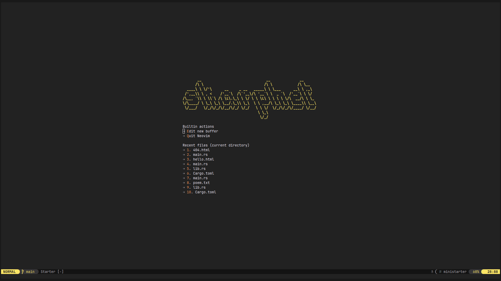
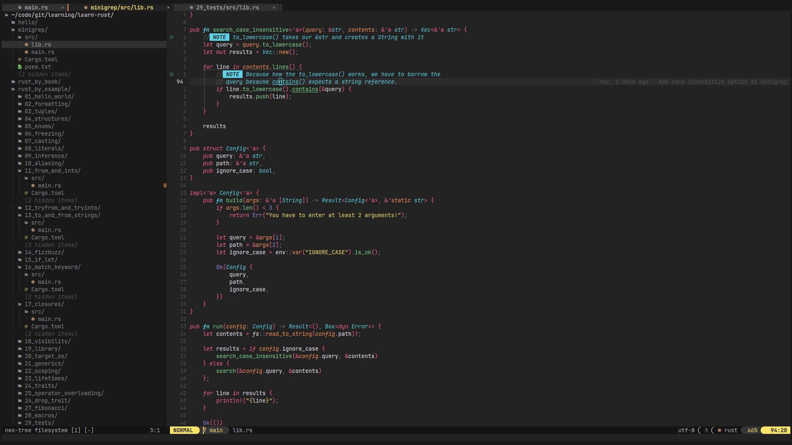

# ✨ neovim-config

This is my personal Neovim configuration built around modern plugins using **lazy.nvim**. Below is a list of the main plugins I use and their purpose.




## 🔌 Key Plugins

- **[Mason](https://github.com/williamboman/mason.nvim)**: Handles LSP installations.
- **[Which-key](https://github.com/folke/which-key.nvim)**: Keybinding helper.
- **[Neo-tree](https://github.com/nvim-neo-tree/neo-tree.nvim)**: File explorer.
- **[Telescope](https://github.com/nvim-telescope/telescope.nvim)**: Fuzzy finder for files, buffers, etc.
- **[nvim-cmp](https://github.com/hrsh7th/nvim-cmp)**: Autocompletion framework.
- **[Treesitter](https://github.com/nvim-treesitter/nvim-treesitter)**: Syntax highlighting and parsing.
- **[Monokai Pro](https://github.com/loctvl842/monokai-pro.nvim)**: Theme I use.
- **[Lualine](https://github.com/nvim-lualine/lualine.nvim)**: Status line plugin.
- **[Gitsigns](https://github.com/lewis6991/gitsigns.nvim)**: Git integration.
- **[Trouble](https://github.com/folke/trouble.nvim)**: Diagnostics and quickfix list.
- **[Mini.nvim](https://github.com/echasnovski/mini.nvim)**: Various enhancements (surround, statusline, etc.).
- **[Barbar](https://github.com/romgrk/barbar.nvim)**: Tabline management.
- **[Rust.vim](https://github.com/rust-lang/rust.vim)**: Rust support.
- **[Crates.nvim](https://github.com/saecki/crates.nvim)**: Rust crate manager.

## 🧁 Additional Features

- **Markdown Preview**: `markdown-preview.nvim` for live Markdown previews.
- **Auto-save**: Automatically saves files during certain events.
- **Blankline**: Shows indentation levels.
- **Todo Comments**: Highlight and manage TODO comments.
- **Neoformat**: Code formatting on demand.
- **Mediawiki support**: `vim-mediawiki` for editing Mediawiki files.

## 🔧 Setup

1. Clone the repository:

   ```sh
   git clone https://github.com/dybdeskarphet/neovim-config.git ~/.config/nvim
   ```

2. Install the plugins:
   Open Neovim and run `:Lazy` to install all the plugins.

3. Optionally, ensure you have `yarn` installed for **Markdown Preview** to work.

## 📜 License

This configuration is open-source under the MIT license.
