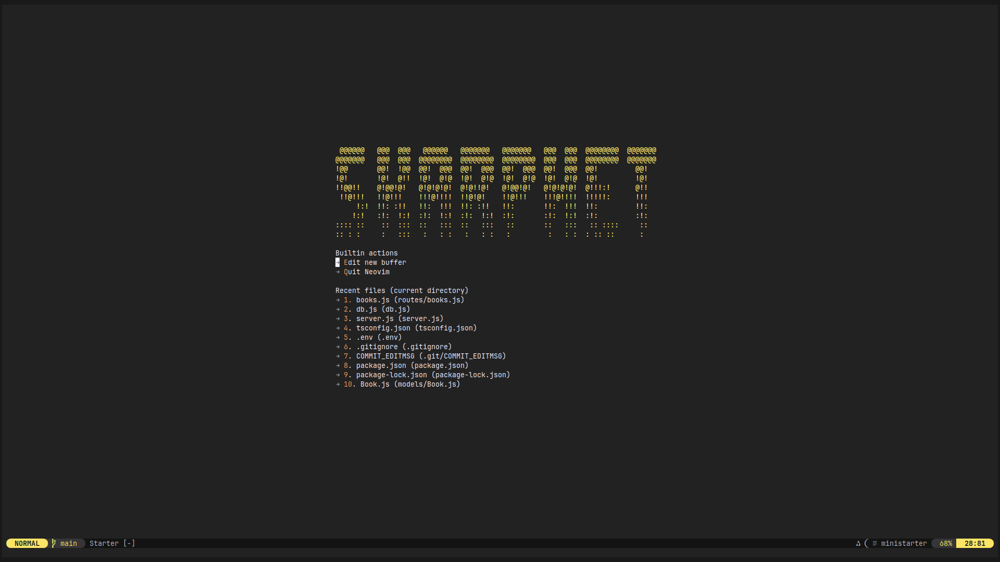
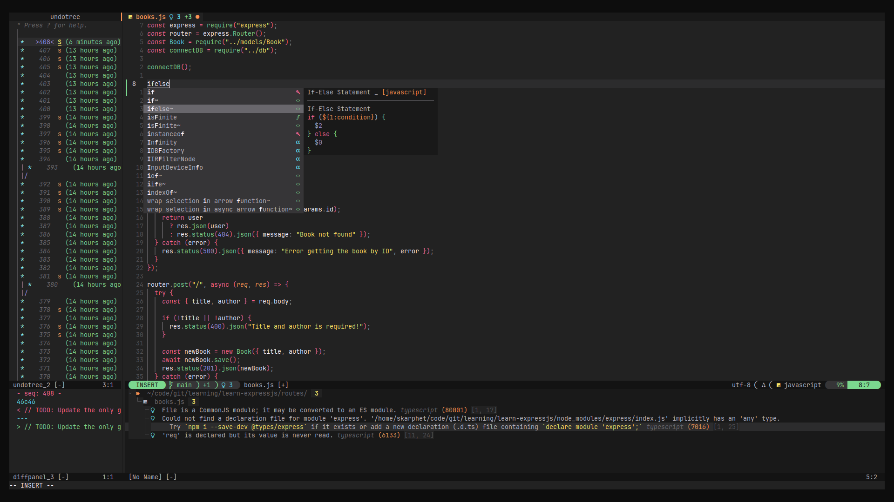

# ✨ neovim-config

This is my personal Neovim configuration, designed for efficiency and customization. It includes various plugins for better development experience, LSP support, formatting, and more.




## 🔥 Features

- **Monokai Pro Theme** – Aesthetic and configurable color scheme.
- **File Manager** – `yazi.nvim` integration for navigation.
- **Better Keybindings** – `which-key.nvim` provides interactive keybinding hints.
- **Auto-closing Tags** – `nvim-ts-autotag` enhances HTML/XML/JSX editing.
- **Indentation Guides** – `indent-blankline.nvim` makes indentation clearer.
- **Color Preview** – `nvim-colorizer.lua` highlights color codes.
- **LSP Support** – Mason, LSPConfig, and `cmp-nvim-lsp` for autocompletion.
- **Snippets & Autocomplete** – LuaSnip, `nvim-cmp`, and `cmp_luasnip`.
- **Error Handling** – `trouble.nvim` for diagnostics and warnings.
- **Fuzzy Finder** – `telescope.nvim` for searching files, symbols, and more.
- **Code Formatting** – `neoformat` with support for various formatters (formatters needs to be in the `$PATH`).
- **CSV Viewing** – `csvview.nvim` for structured table display.
- **Git Integration** – `gitsigns.nvim` for tracking changes.
- **Markdown Support** – Live preview and PDF export with `markdown-preview.nvim` and `md-pdf.nvim`.
- **Auto-save** – `auto-save.nvim` for seamless saving.
- **Undo History** – `undotree` for better undo management.
- **Sudo Editing** – `vim-suda` for saving protected files.
- **LaTeX Support** – `vimtex` for TeX editing with Zathura preview.
- **Refactoring Tools** – Treesitter Refactor for code structure improvements.
- **Auto-pairs** – `nvim-autopairs` for automatic bracket pairing.
- **TODO Highlighting** – `todo-comments.nvim` for tracking tasks in code.

## ⚙️ Installation

Ensure you have Neovim installed, then clone this configuration into your Neovim directory:

```sh
git clone https://github.com/dybdeskarphet/neovim-config ~/.config/nvim
```

## 🔌 Plugins

This configuration uses [lazy.nvim](https://github.com/folke/lazy.nvim) as the plugin manager.

To install plugins, open Neovim and run:

```sh
nvim
```

Optionally, ensure you have `yarn` installed for **Markdown Preview** to build. Lazy.nvim will automatically set up and install everything else.

## 🏗️ Configuration Structure

- `init.lua` – Main entry point, bootstraps `lazy` and loads modules.
- `lua/globals.lua` – Helpers for other modules.
- `lua/keybindings.lua` – Custom keybindings.
- `lua/lsp.lua` – All LSP and completion configurations.
- `lua/plugins/init.lua` – Configurations for plugins with small options.
- `lua/plugins/` – Configurations for plugins with large options.
- `lua/settings.lua` – Additional Neovim settings.

## 📜 License

This configuration is open-source under the MIT license.
