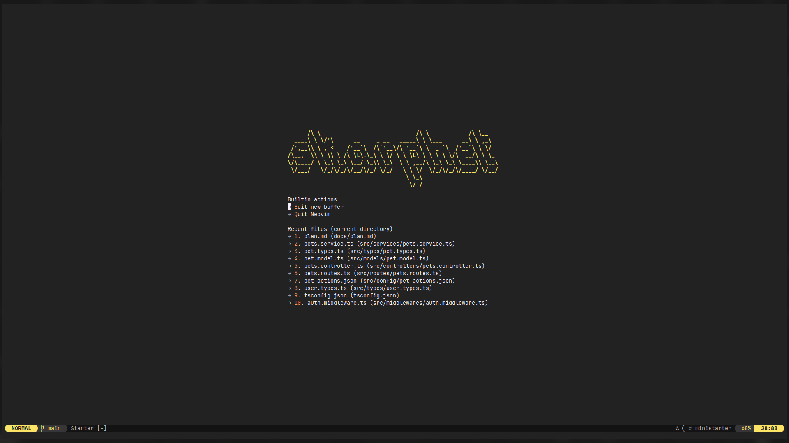
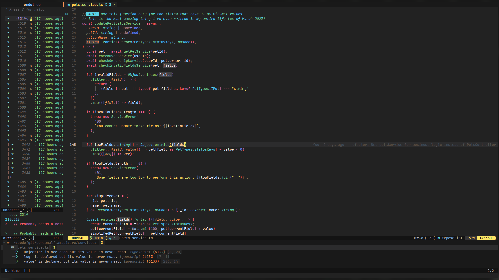

# ✨ neovim-config

This is my personal Neovim configuration, designed for efficiency and customization. It includes various plugins for better development experience, LSP support, formatting, and more.




## 🔥 Features

- **Monokai Pro Theme** – Aesthetic and configurable color scheme.
- **File Manager** – `yazi.nvim` integration for navigation.
- **Better Keybindings** – `which-key.nvim` provides interactive keybinding hints.
- **Auto-closing Tags** – `nvim-ts-autotag` enhances HTML/XML/JSX editing.
- **Color Preview** – `nvim-colorizer.lua` highlights color codes.
- **LSP Support** – Mason and LSPConfig for language server management.
- **Snippets & Autocomplete** – LuaSnip and `blink.cmp` for fast coding.
- **Error Handling** – `trouble.nvim` displays diagnostics and warnings.
- **Fuzzy Finder** – `snacks.nvim - picker` for searching files, symbols, and more.
- **Indentation Guide** – `snacks.nvim - indent` for clear indentation visualization.
- **Code Formatting** – `conform` installs formatters automatically from `mason-registry`.
- **CSV Viewing** – `csvview.nvim` for structured table display.
- **Git Integration** – `gitsigns.nvim` for inline git change tracking.
- **Markdown Support** – Live preview with `markdown-preview.nvim` and PDF export using `md-pdf.nvim`. `easytables.nvim` simplifies markdown table creation.
- **Auto-save** – `auto-save.nvim` automatically saves your work.
- **Undo History** – `undotree` provides a visual undo tree.
- **Sudo Editing** – `vim-suda` enables editing and saving protected files.
- **LaTeX Support** – `vimtex` for TeX editing with Zathura preview.
- **Refactoring Tools** – Treesitter Refactor for improved code structure.
- **Auto-pairs** – `nvim-autopairs` handles automatic bracket pairing.
- **TODO Highlighting** – `todo-comments.nvim` helps track tasks in code.
- **Mediawiki Support** – `vim-mediawiki` provides better syntax highlighting for Mediawiki files.

## ⚙️ Installation

Ensure you have Neovim installed, then clone this configuration into your Neovim directory:

```sh
git clone https://github.com/dybdeskarphet/neovim-config ~/.config/nvim
```

## 🔌 Plugins

This configuration uses [lazy.nvim](https://github.com/folke/lazy.nvim) as the plugin manager.

Plugins will be installed automatically when you open Neovim.

```sh
nvim
```

Optionally, ensure you have `yarn` installed for **Markdown Preview** to build. Lazy.nvim will automatically set up and install everything else.

## 🏗️ Configuration Structure

- `init.lua` – Main entry point, bootstraps `lazy` and loads modules.
- `spell/` – Files for the spellchecker.
- `lua/globals.lua` – Helpers for other modules.
- `lua/settings.lua` – Additional Neovim settings.
- `lua/lsp/` – Additional LSP configurations.
- `lua/plugins/` – Configurations for plugins and their keybindings.
- `lua/snippets/` – Additional snippets for unsupported languages.

## 📜 License

This configuration is open-source under the MIT license.
