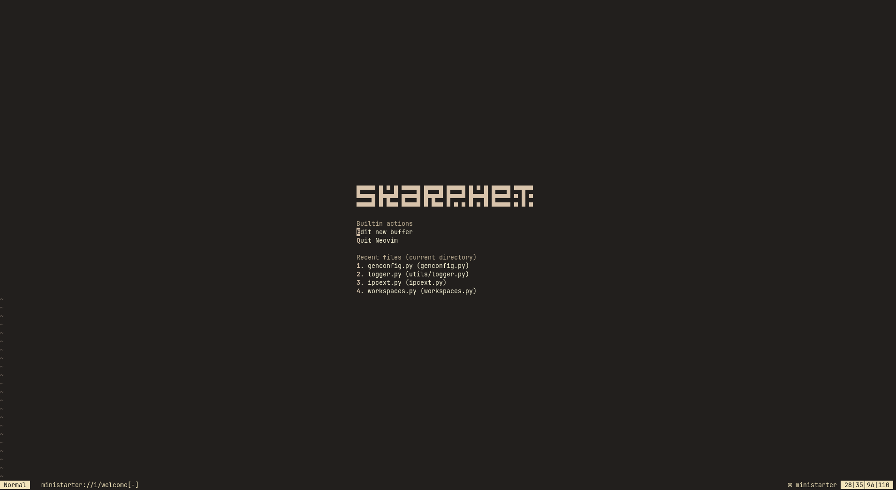

# ✨ neovim-config

This is my personal Neovim configuration, designed for efficiency and customization. It includes various plugins for better development experience, LSP support, formatting, and more.




## ⚙️ Installation

Ensure you have Neovim installed, then clone this configuration into your Neovim directory:

```sh
git clone https://github.com/dybdeskarphet/neovim-config ~/.config/nvim
```

## 🔌 Plugins

This configuration uses [mini.deps](https://github.com/echasnovski/mini.nvim/blob/main/readmes/mini-deps.md) as the plugin manager.

Plugins will be installed automatically when you open Neovim.

```sh
nvim
```

Optionally, ensure you have `npm` installed for **Markdown Preview** to build. Lazy.nvim will automatically set up and install everything else.

## 🏗️ Configuration Structure

- `init.lua` – Main entry point, bootstraps `mini.deps`.
- `after/plugin/` – All the configurations.
- `after/ftplugin/` – Configurtaions for certain file types.
- `spell/` – Spell files.

## 📜 License

This configuration is open-source under the MIT license.
