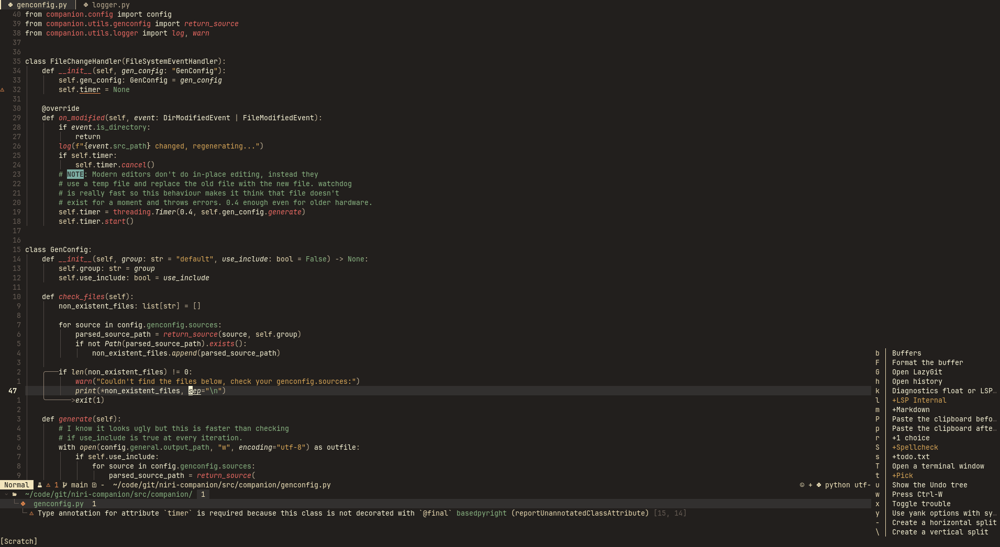

<p align="center">
    
</p>

<p align="center">
This is my personal Neovim configuration, designed for efficiency and customization. It includes various plugins for better development experience, LSP support, formatting, and more.
</p>

## Screenshots




## Installation

Ensure you have Neovim installed, then clone this configuration into your Neovim directory:

```sh
git clone https://github.com/dybdeskarphet/neovim-config ~/.config/nvim
```

Plugins will be installed automatically when you open Neovim.

```sh
nvim
```

Ensure you have `npm` installed for **Markdown Preview** to build. `mini.deps` will automatically set up and install everything else.

## Configuration Structure

- `plugin/` – All the configurations.
- `after/ftplugin/` – Configurtaions for certain file types.
- `spell/` – Spell files.
- `queries/` – User defined queries.
- `snippets/` – User defined snippets (`rafamadriz/friendly-snippets` is also installed; there is no connection between the two).
